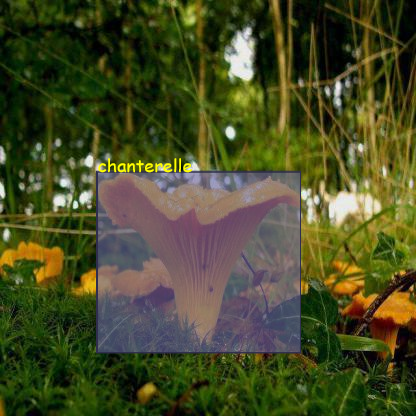
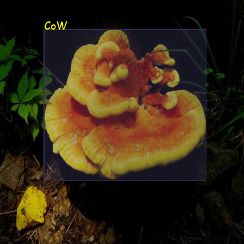
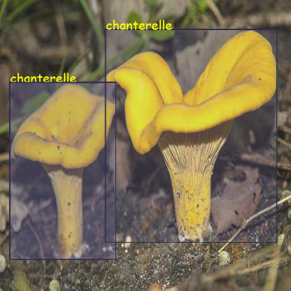

# React Object Detection Visualizer

object-detection-visualizer is a react library that help visualize the data from object detection machine learning models over the image (drawing the bounding boxes over image) using plain html canvas. Being based on the plain canvas, this is extremly efficient in terms of performance. This library supports CreateML Json annotation format.
## Getting Started

To install this library use the npm install command:

    npm install object-detection-visualizer --save

Later import the ObjectDetectionVisualizer component from it

    import ObjectDetectionVisualizer from "object-detection-visualizer";

## Dependencies

`object-detection-visualizer ` has no external dependencies, aside for a version of react and react-dom which support hooks and @babel/runtime.

## Documentation

|       props       |         documentation         |
|:-----------------:|:-----------------------------:|
|       image       |          URL of Image         |
|    annotations    | Annotation in CreateML Format |
| boundingBoxStyles |     Styles of bounding box    |

### annotation
    annotations: {
        label: string;
        coordinates: {
            x: number;
            y: number;
            width: number;
            height: number;
        };
    }
### boundingBoxStyles
    export type BoundingBoxStyles={
    // Fill Color for the bounding box
    boudingBoxFill?:string;
    //Stoke color for the bounding box
    boudingBoxStroke?:string;
    //Opacity of the bounding box between 0 and 1
    boundingBoxOpacity?:number;
    //Color of the label text
    boundingBoxTextColor?:string;
    //Font of the label text
    boundingBoxTextFont?:string;
    //Positon of the Label Text Enum
    boundingBoxTextPosition?:TextPosition,
    //No label is displayed if this is false. Default True
    disableLabel?:boolean;
    //The bounding box has no stroke is displayed if this is false
    disableStroke?:boolean;
    //The bounding box has no fill is displayed if this is false
    disableFill?:boolean;    
}

### Example Usage:

This is the example of using the object detection visualizer.
`data` is the annotation loaded in createML json annotation format.

    function App() {
      return (
        

          {data.map((d) => (
            <ObjectDetectionVisualizer
              annotations={{x:d.annotations}}
              image={`/train/${d.image}`}
              boundingBoxStyles={{
                boundingBoxOpacity: 0.6,
              }}
            />
          ))}
        

      );
    }
### Demo Image

Note: Images from roboflow mushroom dataset 
https://public.roboflow.com/object-detection/na-mushrooms/1/download/coco